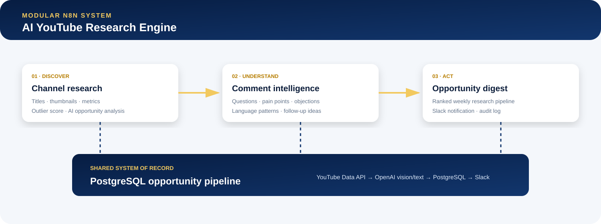
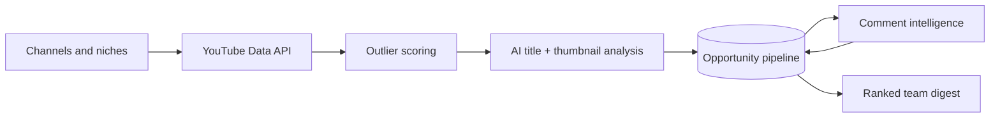
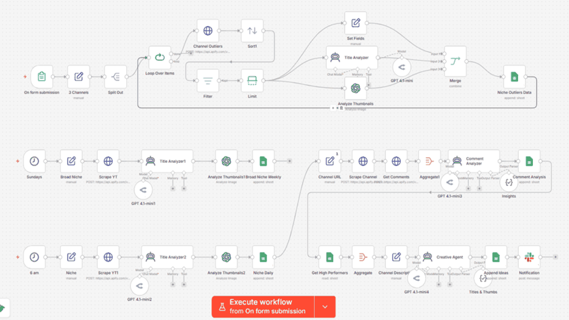
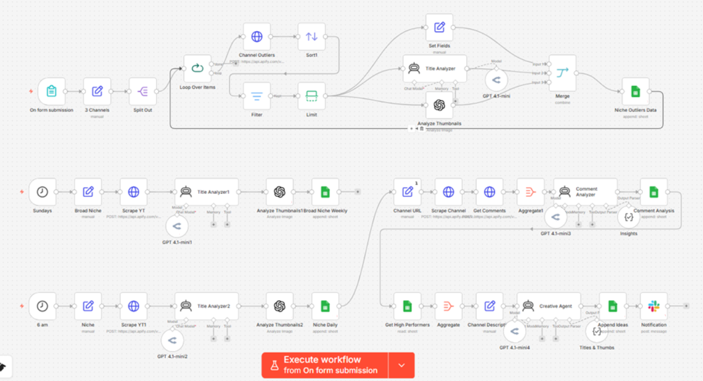

# AI YouTube Research Engine

> Public case study for a production-minded n8n system that discovers YouTube content opportunities through channel research, outlier scoring, multimodal AI analysis, audience-comment intelligence, and structured reporting.


## The challenge

Content teams often research channels, titles, thumbnails, comments, and trends manually. That creates slow handoffs, inconsistent analysis, duplicated work, and little traceability between the original signal and the final content idea.

## The solution

I designed a modular research engine that:

- Monitors configured channels and niches on a UK-time schedule.
- Collects recent video and channel performance signals.
- Ranks videos using view velocity, engagement, and subscriber-normalised outlier scoring.
- Uses multimodal AI to analyse title structure and thumbnail communication.
- Mines comments for questions, pain points, objections, and audience language.
- Stores research in a structured opportunity pipeline.
- Sends a concise ranked digest to the content team.

## Architecture





## Workflow preview





The full system is split into discovery, comment-intelligence, and digest modules. This makes retries, testing, API-cost control, and maintenance clearer than one monolithic workflow.

## Demonstrated engineering decisions

- Official API integration instead of fragile page scraping
- Separate workflows with independent manual-test triggers
- PostgreSQL as an auditable system of record
- Parameterised database writes
- Structured and guarded AI-response parsing
- API quota and model-cost limits
- Quiet no-results behaviour to avoid notification noise
- `Europe/London` scheduling for automatic GMT/BST handling
- Fictional sample data and credential-free exports

## Public sample workflow

[`sample-workflow/opportunity-scoring-demo.json`](sample-workflow/opportunity-scoring-demo.json) is an importable n8n demonstration using fictional metrics. It exposes the scoring concept without publishing:

- Production API orchestration
- Private AI prompts and evaluation logic
- Complete database operations
- Notification configuration
- Credentials or environment details

Run the sample after importing it into n8n; it needs no credentials and calls no external service.

## Scoring concepts

- View velocity = views ÷ hours since publication
- Outlier score = views ÷ channel subscribers
- Engagement rate = (likes + comments) ÷ views × 100

These are research signals rather than universal measures of content quality. Production thresholds are calibrated for the target niche and channel size.

## Validation

```bash
npm run validate
```

The validator checks the public n8n export, Code-node syntax, duplicate names, required fields, and common secret patterns.

## Technology

n8n · YouTube Data API · Multimodal AI · PostgreSQL · Slack · JavaScript · SQL

## Source-code access

The full implementation is maintained in a private repository because it contains reusable orchestration and production integration logic. Verified employers or clients may request a guided private code review.

This public repository intentionally contains only the case study, architecture, visual preview, and a limited credential-free sample workflow.

## Contact

Visit [Rico Integration](https://ricointegration.com/) to discuss a similar automation or request a private technical walkthrough.

## Usage

The case-study content and workflow preview are provided for portfolio evaluation. No permission is granted to reproduce or redistribute the private production implementation.
